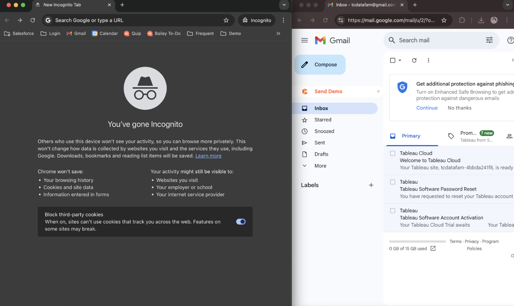

# TC25_VHOT_Manual
## Lab Sections
- **[Step 1: Create a Tableau Cloud Trial Site](https://github.com/baileyferrari/TC25_VHOT_Manual/blob/main/README.md#step-1-create-a-tableau-cloud-trial-site-bailey)**

- **[Step 2: Configure Your Tableau Cloud Site](https://github.com/baileyferrari/TC25_VHOT_Manual?tab=readme-ov-file#step-2-configure-your-tableau-cloud-site)**

- **[Step 3: Upload "Sales Cloud Data" as a Published Data Source](https://github.com/baileyferrari/TC25_VHOT_Manual?tab=readme-ov-file#step-2-configure-your-tableau-cloud-site)**

- **[Step 4: Create Pulse Metrics](https://github.com/baileyferrari/TC25_VHOT_Manual?tab=readme-ov-file#step-4-create-pulse-metrics)**
  - Open Pipe  
  - Win Rate  
  - Average Days to Close

- **[Step 5: Create Advanced Visualizations](https://github.com/baileyferrari/TC25_VHOT_Manual?tab=readme-ov-file#step-4-create-pulse-metrics)**
  - Top Accounts  
  - Top Sellers  

- **Step 6: Pull Your Metrics & Visualizations into a Dashboard**
  - Sales Overview

- **Step 7: Publish & Interact**


---

# Step 1: Create a Tableau Cloud Trial Site

## 1. Set Up Your Browser Windows

1. Open your preferred web browser (e.g., Chrome, Edge, Firefox).
2. Open **two windows side-by-side**:
   - **Window 1 (Standard)**: Your regular browser window, already signed into your preferred email account (e.g., Gmail, Outlook email).
   - **Window 2 (Incognito/Private Mode)**: Open a new incognito/private window:
     - In Chrome: `Ctrl+Shift+N` (Windows) or `Cmd+Shift+N` (Mac)
     - In Edge: `Ctrl+Shift+N`
     - In Firefox: `Ctrl+Shift+P` (Windows) or `Cmd+Shift+P` (Mac)

> We'll use the **incognito window** for all Tableau setup and access going forward. This ensures we avoid saved sessions or conflicts from existing Tableau accounts.

<details>
  <summary> ⚠️ <strong> HINT </strong> - Expand to view example sceenshot </summary>

  

</details>

<br>

## 2. Set Up Tabs in the Incognito Window

In your **incognito window**, open the following two tabs:

- **Tab 1**: Open the **GitHub repository** for this lab:  
  👉 [TC25 Lab Repository](https://github.com/baileyferrari/TC25_VHOT_Manual)

  > This repo contains everything you'll need for the session, including:
  > - The full **lab manual** to follow along step-by-step
  > - A **CSV data source** file that we’ll upload into Tableau Cloud later

- **Tab 2**: Open the Tableau Cloud Trial signup page:  
  👉 [Start Tableau Cloud Free Trial](https://www.tableau.com/products/trial)

<br>

## 3. Set Up Your Standard Window

In your **standard (non-incognito)** browser window:

- Make sure you are **signed into your email account** (e.g., Gmail, Outlook, or your Salesforce email).
- You only need **one tab open** in this window.
- This is the inbox where you’ll receive the **Tableau Software Account Activation** email.

> 💡 Keep this window open — you’ll switch to it briefly during the activation step.

<br>

## 4. Fill Out the Trial Signup Form

On the [Tableau Trial Page](https://www.tableau.com/products/trial), complete the form with the following details:

- **First Name**
- **Last Name**
- **Company Name** – Your organization or a placeholder.
- **Email** – Use your preferred email address, but **append `+TC25` just before the `@` symbol**:
  - Example:
    - `john.doe+TC25@salesforce.com`
    - `tsmith+TC25@gmail.com`
- **Phone Number** – Enter your preferred phone number.
- **Job Role / Department / Country** – Select as appropriate.

✅ Check the box to agree to the terms, then click **Start Free Trial**.

<br>

## 5. Activate Your Tableau Account (Important!)

1. In your **standard browser window** (signed into your email), look for an email with the subject:  
   **`Tableau Software Account Activation`**

2. **DO NOT click the link directly in the email.** Instead:

   - **Right-click** the button or link in the email.
   - Select **"Copy link address"** (or similar, depending on your email provider).
   - Switch to your **incognito window** and open a **new tab**.
   - **Paste** the copied link into the address bar and hit **Enter**.

> 🛠️ **Why this step matters:**  
> Opening the activation link in incognito prevents Tableau from auto-redirecting you to an existing site. This ensures you're creating a brand-new Tableau Cloud trial site — even if you're part of a paid org or have requested a trial before.

<br>

## 6. Set Your Password & Finish Setup

1. Once you open the activation link in the incognito window, Tableau will recognize your email and display your username.
2. You’ll be prompted to **set a password**.

   - It must meet Tableau’s password criteria.
   - For this exercise, we are using:  
     **`DataRockstar1!`**

   > You may choose your own secure password if you'd like — this is just for simplicity during the lab.

3. Click **Submit**. Tableau will begin provisioning your site.

<br>

## 7. Wait for Trial Activation

- You’ll see a message that says:  
  **“Activating your trial site...”**
- This process takes **1–2 minutes**.
- When finished, you’ll be automatically redirected to your new **Tableau Cloud site homepage**.

<br>

✅ **Done!** You’ve successfully created your Tableau Cloud trial site. We’ll use this site throughout the rest of the lab, be sure to keep this tab open!

<br>

---

# Step 2: Configure Your Tableau Cloud Site

Now that your trial site is activated, let’s configure it to unlock powerful AI and agentic capabilities we’ll be using throughout the lab.

<br>

## 1. Open Site Settings

1. From the **Home** page of your Tableau Cloud site, scroll to the very bottom of the left-hand navigation.
2. Click **Settings**.

<br>

## 2. Enable AI Features (General Tab)

1. The **Settings** page will default to the **General** tab.
2. Under the section titled **“Turn on AI in Tableau by feature area”**, **check every checkbox** that appears — these enable:
   - Tableau Pulse summaries
   - Semantic question matching
   - Pulse Discover
   - Conversational Web Authoring
   - Tableau Prep suggestions

3. Your screen should look like this:

   

4. Click the **blue "Save"** button in the upper right corner of the screen to apply these settings.

<br>

✅ **Nice job!** Your Tableau Cloud site is now fully configured for AI-driven insights and advanced reporting!

<br>

---

# Step 3: Upload "Sales Cloud Data" as a Published Data Source

Next, we’ll upload the **Sales Cloud Data** file into Tableau Cloud to use in our exercises. This process creates a **Published Data Source** directly from the browser — no Tableau Desktop required.

## 1. Download the CSV File

In **Tab 1** of your incognito window (where the GitHub repo is open), locate and download:  
**`Sales Cloud Data.csv`**

> 💾 Save this file somewhere easy to find, like your **Downloads** folder.

<br>

## 2. Start the Upload Process

Go back to your Tableau Cloud **Home** page.  
Click the **“New”** drop-down menu at the top.  
Select **“Published Data Source”** from the list.

<br>

## 3. Connect to the CSV File

In the **Connect to Data** window that opens:  
Toggle to the **"Files"** tab at the top.  
Click to **browse for a file** and select the `Sales Cloud Data.csv` file you downloaded.

<br>

## 4. Publish the Data Source

Once the data loads, click **“Publish As...”** in the top-right corner.  
In the popup window:
- Name the data source: **`Sales Cloud Data`**
- Keep the default project folder selected.

Click **Publish**.

<br>

## 5. Finish & Return to Home

If you see a success message, acknowledge or close any pop-ups.  
In the upper left corner, click **“File”** → **“Close”** to return to your Tableau Cloud **Home** page.

✅ **Success!** You’ve now uploaded and published your first data source to Tableau Cloud. You’ll use this dataset in the next steps of the lab.

<br>

---

# Step 4: Create Pulse Metrics

In this step, you’ll create three dynamic Pulse Metrics using the "Sales Cloud Data" source you uploaded earlier.

---

### Open Pipeline Metric

## 1. Create New Metric

1. From the left-hand navigation, click **Pulse**.
2. Click **New Metric Definition**.
3. Search for and connect to your **Sales Cloud Data** published data source.
4. Label the metric: **Open Pipeline**

<br>

## 2. Metric Setup
- **Measure**: `Amount`
  - Keep Aggregation as default: `Sum`, `Running Total`
- **Time Dimension**: `Close Date`

<br>

## 3. Add Definition Filters
- Filter on `Stage`
  - **Exclude**: `Closed Lost`, `Closed Won`

<br>

## 4. Adjustable Metric Filters
- Account Name  
- Account Type  
- Opportunity Owner  
- Stage  
- Forecast Category  

<br>

## 5. Formatting
- **Number Format**: Currency (`USD`)

<br>

## 6. Time Settings
Click **Next > Time**
- **Date Offset**: `180 days`  
- **Minimum Time Granularity**: `Week`  
- **Time Comparison**: Keep defaults (`Prior Year`, `Prior Period`)

<br>

## 7. Goal Settings
Click **Next > Goals**
- Skip for now — we’ll set a manual goal later.

<br>

## 8. Add Insights
Click **Next > Insights**
- **Value Going Up**: `Favorable`  
- **Record Identifier**: `Account ID`  
- **Record Identifier Name**: `Account Name`  
- **Singular**: `Account`, **Plural**: `Accounts`

Leave other insights settings unchanged.

<br>

## 9. Final Steps
- **Add Yourself** as a follower of the metric.
- After the metric is created, click the **ellipses (…)** on the metric tile and select **Set Goal**.
  - Type in: `600,000,000`
  - Click **Save**
- Explore your new **Open Pipeline** metric!

<br>

### ⏱️ Average Days to Close Metric

## 1. Create New Metric
1. Click **New Metric Definition**.
2. Connect to the same **Sales Cloud Data** source.
3. Label the metric: **Avg Days to Close**

<br>

## 2. Metric Setup
- **Measure**: `Days to Close`
  - Change Aggregation to: `Average`
- **Time Dimension**: `Close Date`

<br>

### Definition Filters
- Filter on `Stage`
  - **Include only**: `Closed Won`

<br>

## 3. Adjustable Metric Filters
- Account Name  
- Forecast Category  
- Opportunity Owner  
- Account Type  
- Lead Source  

<br>

## 4. Formatting
- **Number Format**: `Number`  
- **Singular**: `Day`  
- **Plural**: `Days`

<br>

## 5. Time Settings
Click **Next > Time**
- **Date Offset**: `180 days`  
- **Minimum Time Granularity**: `Week`  
- **Time Comparison**: Keep defaults

<br>

## 6. Goal Settings
Click **Next > Goals**  
- Skip

<br>

## 7. Insights
Click **Next > Insights**
- **Value Going Up**: `Unfavorable`
- **Turn off** Record Level Insights

Click **Save**, then **Follow the Metric**.  
Return to the **Pulse Home Page**.

<br>

### 🏆 Win Rate Metric

## 1. Create a New Metric
1. From the Pulse Home Page, click **New Metric**.
2. Connect to the **Sales Cloud Data** data source.
3. Title the metric: **Win Rate**

<br>

## 2. Advanced Definition Setup

1. Click **Advanced Definition**.
2. In the Advanced Analytics Editor, create a new calculated field:
   - **Name**: `Win Rate`
   - **Formula**:  
     ```
     SUM([Opportunities Won]) / COUNTD([Opportunity ID])
     ```
   - Click **OK**

3. Drag the `Win Rate` calculated field to the **Measure** box.
4. Drag `Close Date` to the **Time Dimension** box.
   - Click into the drop-down of the **YEAR(Close Date)** field → Select `Month` → Click **Apply**
  
<br>

## 3. Adjustable Metric Filters
- Opportunity Owner  
- Industry  
- Lead Source  

<br>

## 4. Formatting
- **Number Format**: `Percentage`

Click **Next**

<br>

## 5. Time Settings
- **Date Offset**: `180 days`  
- **Minimum Time Granularity**: `Week`

Click **Next**

<br>

## 6. Insights
- **Value Going Up**: `Favorable`
- **Turn Off** Record Level Outliers

Click **Save**, then **Follow the Metric**.

<br>

✅ After completing this step, you’ll have three active Pulse Metrics:
- **Open Pipeline**
- **Avg Days to Close**
- **Win Rate**

You’re now ready to move on to building visualizations!

---

# Step 5: Create Advanced Visualizations

### 🔹 Visualization 1: Open Pipeline by Sales Rep

Let’s build a visualization to show open pipeline by sales rep.

<br>

#### 1. Set up your basic bar chart:
- In the **Data pane** on the left, drag **`Amount`** onto the **Columns** shelf.
- Drag **`Opportunity Owner`** onto the **Rows** shelf.

You should now see a horizontal bar chart showing the total opportunity amount each sales rep has ever owned.

<br>

#### 2. Add filters to narrow the data:
- Drag **`Stage`** onto the **Filters** shelf:
  - In the filter pop-up, check **`Closed Lost`** and **`Closed Won`**
  - Click **“Exclude selected values”**
  - Hit the blue **OK** button
  - To apply this filter to all future visualizations:
    - Click the dropdown on the Stage filter pill > **Apply to Worksheets** > **All Using This Data Source**

<br>

- Drag **`Close Date`** onto the Filters shelf:
  - In the pop-up, choose **Relative Date** > click **Next**
  - Change the dropdown from “Days” to **Years**
  - Keep the default **“This year”** selection
  - Click **OK**
  - Apply this filter to all future visualizations:
    - Click the dropdown on the Close Date filter pill > **Apply to Worksheets** > **All Using This Data Source**

<br>

#### 3. Change the visualization type:
- Click the **Show Me** tab in the top right
- Select the **Treemap** chart type

<br>

#### 4. Add context with a label:
- Find **`Opportunity ID`** in the Data pane
- On **Mac**: hold **Option** and drag `Opportunity ID` to the **Label** section on the **Marks card**
- On **Windows**: hold **Ctrl** and drag `Opportunity ID` to **Label**
- In the dialog that appears, choose **CNTD(Opportunity ID)** and click **OK**

This will now show the **amount** represented by **size**, and the **number of opportunities** per rep as a label.

<br>

#### 5. Rename your worksheet:
- Double-click the sheet tab and rename it:  
  **`Amount by Rep`**
  
<br>
---

### 🔹 Visualization 2: Top 10 Accounts by Stage

Next, we’ll create a more detailed view of opportunity amount by account name.

#### 1. Build the base chart:
- Drag **`Amount`** to the **Columns** shelf
- Drag **`Account Name`** to the **Rows** shelf
- Click the **Sort** icon in the toolbar to sort account names by value

<br>

#### 2. Filter to the top 10 accounts:
- Drag **`Account Name`** to the **Filters** shelf
- In the filter dialog, go to the **Top** tab
  - Choose **By Field**
  - Set:
    - **Top**: leave as-is
    - **Count**: `10`
    - **Field**: `Amount`
    - **Aggregation**: `Sum`
  - Click **OK**

<br>

#### 3. Add color by stage:
- Drag **`Stage`** to the **Color** section of the **Marks** card

<br>

#### 4. Make it color-blind friendly:
- Click on the **Color** legend in the Marks card
- In the **Edit Colors** window:
  - Change the palette to **Color Blind**
  - Click **Assign Palette**
  - Then click **OK**

<br>

#### 5. Rename your worksheet:
- Double-click the sheet tab and rename it:  
  **`Accounts by Stage`**

<br>

# Step 6: Pull Your Metrics & Visualizations into a Dashboard

Now that we've created visualizations and Pulse metrics, it's time to combine them into a single, interactive dashboard.

### 🔧 Create the Dashboard

1. **Open a new dashboard**:
   - Click the **Dashboard icon** at the bottom of the screen (next to your worksheet tabs).

<br>

2. **Rename the dashboard**:
   - Double-click where it says **"Dashboard 1"**
   - Rename it: **`Sales Overview`**

<br>

3. **Adjust dashboard sizing**:
   - In the **Dashboard pane** on the left, change the **Size** dropdown to `Automatic`.
   - _(Optional but recommended)_ After adjusting to Automatic, consider switching to **Fixed** for a more consistent and performant layout.

<br>

### 🧱 Build the Layout with Containers

1. In the **Objects** section of the **Dashboard pane**, drag out **two Horizontal containers**:
   - Place the **first container** to take up the full width of the dashboard (upper half).
   - Drop the **second container** just below it (lower half of the dashboard).
  
<br>

### 📊 Add Pulse Metrics to the Top Container

1. In the **Objects** pane, find **Pulse Metric**.
<br>
2. Drag in each of your three metrics to the **top container**:
   - **Open Pipeline**
     - Select the **"Quarter to Date"** card
     - Keep all defaults, click **Add to Dashboard**
   - **Avg Days to Close**
     - Select **Quarter to Date** > Add to Dashboard
   - **Win Rate**
     - Select **Quarter to Date** > Add to Dashboard
<br>
3. Once all three are added, double-click the **gray hamburger menu** at the top of the container.
   - In the **blue dropdown menu**, select **Distribute Contents Evenly**

<br>

### 📈 Add Visualizations to the Bottom Container

1. In the **Sheets** pane, drag **`Amount by Rep`** into the **bottom horizontal container** (left side).
   - A legend may appear on the right—don’t worry, we’ll remove it later.
<br>
2. Drag **`Accounts by Stage`** into the **right side** of the same container.
<br>
3. Remove the legends:
   - Click the vertical section containing the legends
   - Click the blue **X** in the upper-left of that container to delete it

<br>

### 🎨 Format the Dashboard

1. **Show the dashboard title**:
   - In the top menu, go to **Dashboard** > **Show Title**
<br>
2. **Distribute visualizations evenly**:
   - Click into either viz, then double-click the **gray hamburger menu**
   - In the **blue dropdown**, select **Distribute Contents Evenly**
<br>
3. **Fit both visualizations to screen**:
   - Click into **Amount by Rep**, use the dropdown to set **Fit** to **Entire View**
   - Repeat for **Accounts by Stage**

<br>

### 🔄 Add Filter Action (Interactivity)

1. In **Amount by Rep**, click the **filter icon** on the viz toolbar to enable interactivity.
   - Try clicking on **John Demby** in the treemap — you’ll see the other viz filter by rep.
<br>
2. Uh oh! Only a few accounts appear — not the top 10. Why?
   - By default, Tableau is showing the top 10 **overall**, not per rep.
   - To fix this, we’ll **add the filter to context**.

<br>

### ❓ What’s a Context Filter?

A **context filter** tells Tableau to apply one filter *before* calculating another. This ensures that our **"Top 10 Accounts"** is calculated **per sales rep**, not globally.

<br>

### 🛠️ Fix the Filter with Context

1. In the dashboard, click into the **Accounts by Stage** worksheet (via the icon beneath the "X" in its corner).
2. In the **Filters** shelf, find **`Action (Opportunity Owner)`**
3. Click its dropdown > select **Add to Context**

<br>

### ✅ Publish the Dashboard

1. From the **Accounts by Stage** worksheet, click the light blue **Publish As…** button in the top-right.
2. Name your workbook: **`Sales Overview`**

<br>
---

# Step 7: Publish & Interact

Now that it's published, let's try it out!

1. In the green banner at the top of the screen, click **Go to Workbook**
2. Click to open the **Sales Overview** dashboard.

3. Try it out!
   - Click the **“John Demby”** rectangle in the treemap.
   - Watch the bottom chart update to show **John’s top 10 accounts**.
   - Hover over the stacked bars — you’ll see insights like:
     - “John has over $4.5M with Displaytech in the Qualification stage.”

<br>

### ⏸️ PAUSE: Tableau Agent Demo

We’re pausing here for a live walkthrough of Tableau Agent.

If you're following along later or exploring on your own:

- Continue to the next section of this lab manual for **starter prompts** using this same dataset.
- You’re also welcome to use your **own prompts** or **upload new data**.
- This trial site is **completely secure** and **only accessible to you** (or others you explicitly invite).

<br>

---

# OPTIONAL / SELF-PACED - Step 8: Create Visualizations with Tableau Agent

In this step, you'll use Tableau Agent to build three key visualizations based on your uploaded "Sales Cloud Data" source.

---

## 1. Navigate to the Home Page

- Click the **Tableau** logo or select **Home** from the left-hand navigation to return to the Home page.

---

## 2. Access the Sales Cloud Data Source

- Click the **Explore** tab in the left-hand sidebar.
- Navigate to the **Default** project.
- Locate the **Sales Cloud Data** published data source.
- Click the **New** dropdown and select **Workbook Using This Data Source**.

---

## 3. Engage with Tableau Agent

- Click the **Agentforce** logo in the top-left to launch Tableau Agent.
- Click the blue **"Got it"** button to enter the conversational experience.

---

## 4. Create the "Top Reps" Visualization

1. In Tableau Agent, type:  
   **`amount by owner`**  
   → A horizontal bar chart will appear showing total amount by opportunity owner.

2. Click **Show Me** in the top-right and select the **Treemap** chart type.

3. Add a label for distinct opportunities:
   - Locate **Opportunity ID** in the Data pane.
   - Right-click (or Command-click on Mac) and **drag** it onto the **Marks card > Label**.
   - In the dialog, choose **CNTD(Opportunity ID)**.

4. Rename the worksheet:
   - Click the sheet tab at the bottom.
   - Rename it to **Top Reps**.

---

## 5. Create the "Top Open Opps" Visualization

1. Open a **new worksheet**.

2. Open Tableau Agent and type:  
   **`Show opportunity name by amount`**

3. Filter the data:
   - Type: **`Exclude closed won and closed lost opportunities`**
   - Then: **`Filter to top 10 accounts by amount`**
   - Then: **`Add stage to color`**

---

<br>

✅ You now have two visualizations, all thanks to Tableau Agent!
- **Top Reps** – Treemap with opportunity count
- **Top Open Opps** – Filtered bar chart showing key accounts


